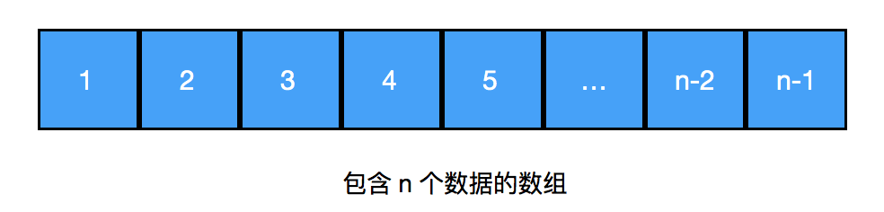
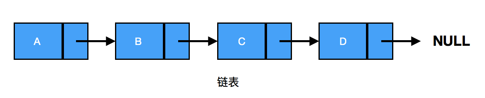
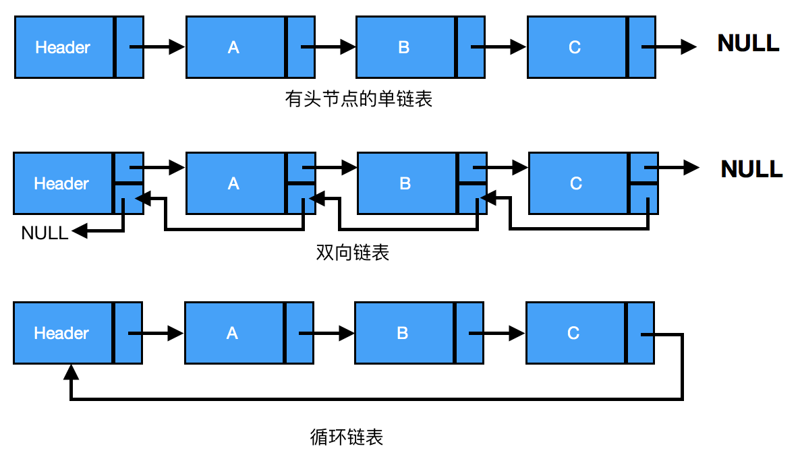
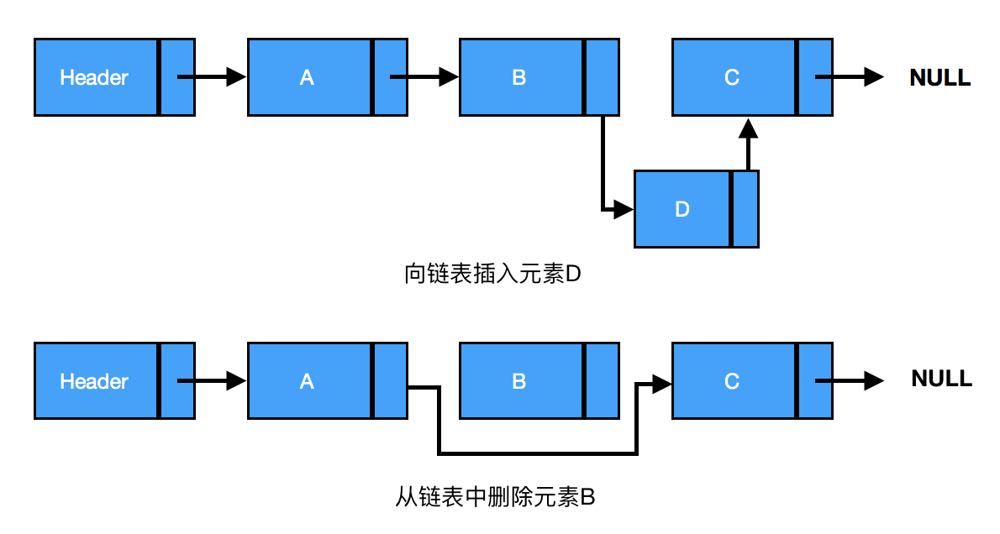
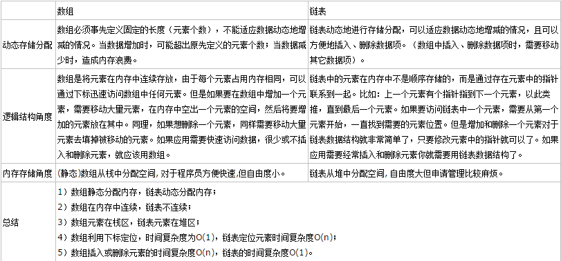
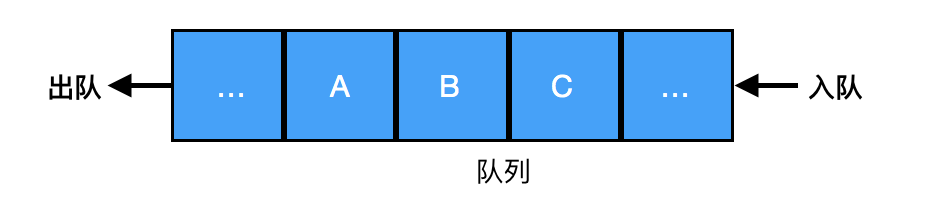
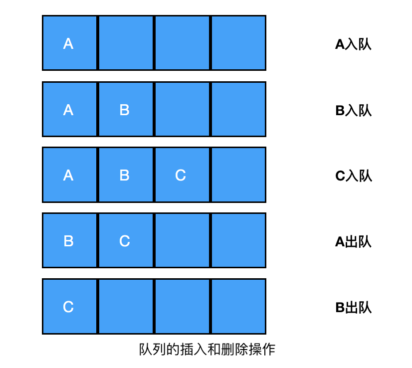
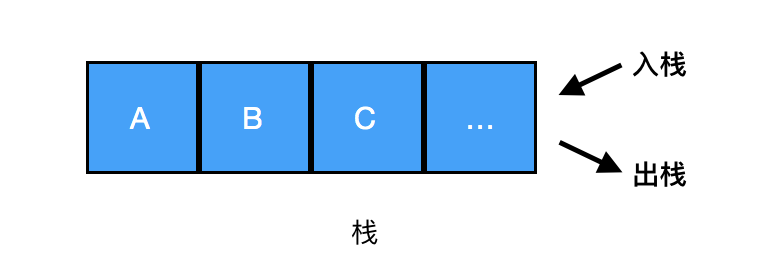
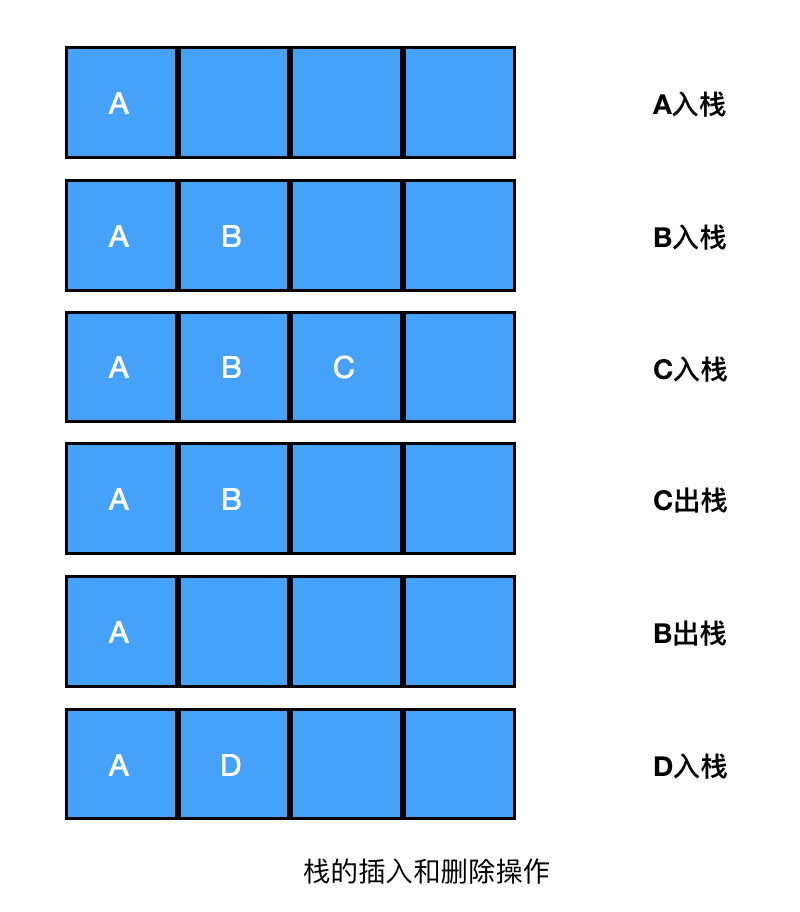

# 数组、链表、队列、栈
原文请参考：[数据结构与算法之数组、链表、队列、栈][1]  
## 数组
### 定义
数组是一个存储元素的线性集合，它使用一块连续的内存空间保存数据，保存的数据的个数在分配内存的时候就是确定的。      
    
### 数组特点 
- 访问数组中第 n 个元素的时间花费是O(1) ，在数组中查找一个指定的元素则是O(N)。
- 向数组中插入或删除元素时，最好的情况是在数组的末尾进行操作，时间复杂度是O(1) ，最坏情况是插入或者删除第一个元素，时间复杂度是O(N) 。
- 在数组的任意位置插入或删除元素时，后面的元素全部需要移动，移动的元素和元素个数有关，总体的时间复杂度仍然是O(N) 。

## 链表
### 定义
链表是由一组节点组成的集合。每个节点包括两个部分：一个是存储数据元素的数据域，另一个是存储下一个结点地址的指针域。每个节点都使用一个对象的引用指向它的后继，最后一个节点的指针指向NULL。   

链表不需要提前分配固定大小存储空间，当需要存储数据的时候分配一块内存并将这块内存插入链表中。   
     
### 链表分类 
链表分为单链表、双链表、循环链表。    

   

### 特点
在链表中查找第 n 个数据以及查找指定的数据的时间复杂度是 O(N) ，插入和删除数据的时间复杂度是 O(1) 。  

   

[1]: https://www.cnblogs.com/sunshineliulu/p/7692858.html
### 数组和链表的区别：
    

## 队列
### 定义
队列是一种先进先出（First-In-First-Out，FIFO）的数据结构，用于存储按顺序排列的数据。  
### 特点
- 队列只能在队尾插入元素，在队首删除元素。   
- 队列可以使用数组和链表来实现。     

    
### 操作
队列的两种操作主要是：在队尾插入新元素和删除队首的元素。插入操作也叫做入队，删除操作也叫做出队。  

  
## 栈
### 定义
栈是一种后进先出（Last-In-First-Out，LIFO）的数据结构，栈内的元素只能通过列表的一端访问，这一端称为栈顶。  
### 特点 
由于栈具有后入先出的特点，所以任何不在栈顶的元素都无法访问。为了得到栈底的元素，必须先拿掉上面的元素。   
### 结构 
栈也可以使用数组和链表来实现。 
 
### 操作
栈的两种操作主要是：将一个元素压入栈和将一个元素弹出栈。  
 